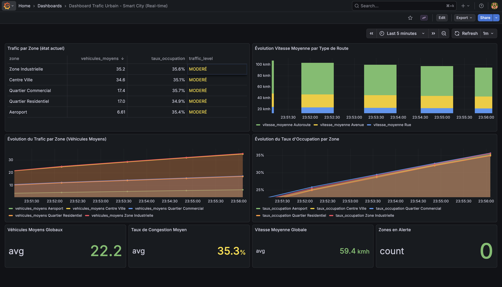
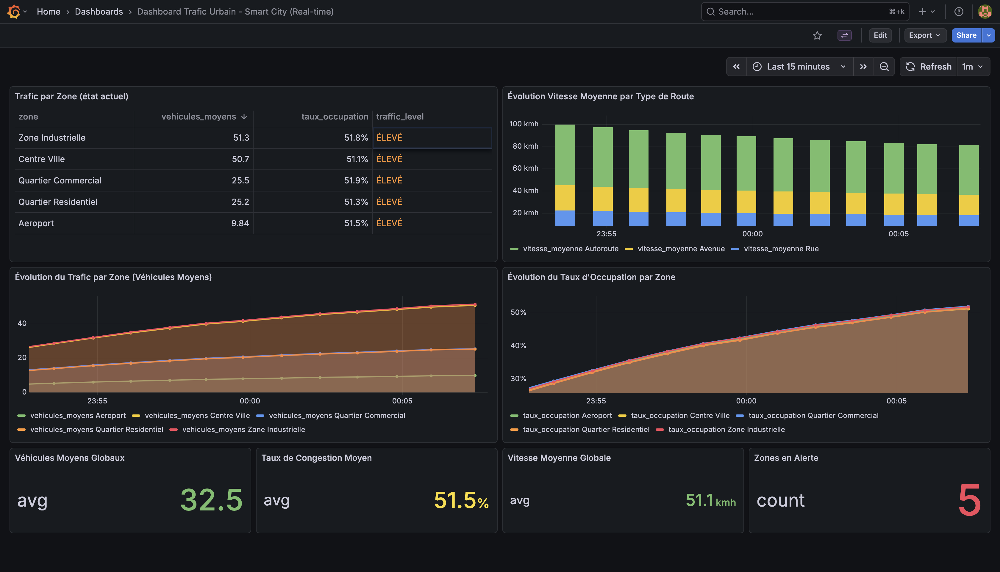

<div>

# Smart City Traffic Pipeline

**Kafka • HDFS • Spark • PostgreSQL • Airflow • Grafana**


</div>

Pipeline Big Data End-to-End pour simuler et analyser le trafic urbain.

## Sommaire

- [Objectif](#objectif)
- [Architecture (flux)](#architecture-flux)
- [Prérequis](#prérequis)
- [Services & Ports](#services--ports)
- [Structure du repo](#structure-du-repo)
- [Démarrage (étape par étape)](#démarrage-étape-par-étape)
- [Airflow (orchestration)](#6-airflow-orchestration)
- [Grafana (visualisation)](#7-grafana-visualisation)

## Objectif

- Générer des événements de trafic (capteurs simulés) et les publier sur Kafka.
- Ingestion Kafka → Data Lake HDFS (zone *raw* en JSONL partitionné).
- Traitements batch Spark :
  - *raw* → *processed*
  - *processed* → *analytics*
- Export des résultats analytics vers PostgreSQL (pour la BI).
- Orchestration/scheduling avec Airflow.
- Visualisation des KPIs dans Grafana.

## Architecture (flux)

1. `traffic_generator/generator.py` → Kafka topic `traffic-events`
2. `kafka/kafka_to_hdfs.py` → HDFS `/data/raw/traffic/...` (fichiers JSONL)
3. Spark batch :
   - `spark/raw_to_processed.py` → HDFS `/data/processed/traffic/...`
   - `spark/processed_to_analytics.py` → HDFS `/data/analytics/traffic/...`
4. `spark/analytics_to_postgres.py` → PostgreSQL DB `traffic`
5. Airflow orchestre les jobs Spark (et peut être étendu pour inclure l’ingestion).
6. Grafana lit PostgreSQL et affiche les dashboards.

## Prérequis

- Docker + Docker Compose
- Python 3.11 (si tu lances les scripts en local

## Services & Ports

| Service | Depuis l'hôte | Depuis Docker (même network) |
|---|---|---|
| Kafka | `localhost:9094` | `broker:9092` |
| HDFS NameNode UI | http://localhost:9870 | http://namenode:9870 |
| HDFS fs.defaultFS | `hdfs://namenode:8020` | `hdfs://namenode:8020` |
| Spark Master UI | http://localhost:8080 | http://spark-master:8080 |
| PostgreSQL | `localhost:5432` | `postgres:5432` |
| Airflow UI | http://localhost:8081 | http://airflow-webserver:8080 |
| Grafana UI | http://localhost:3000 | http://grafana:3000 |

> Notes rapides
>
>- **Identifiants Airflow**: `admin/admin`
>- **Identifiants Grafana**: `admin/admin`
>- **PostgreSQL**: DB `traffic`, user `traffic_user`, pass `traffic_password`

## Structure du repo

- `traffic_generator/`: génération d’événements (producer Kafka)
- `kafka/`: ingestion Kafka → HDFS
- `spark/`: jobs Spark batch + export PostgreSQL
- `airflow/dags/`: DAG Airflow
- `grafana/`: provisioning & dashboards Grafana
- `data/`: volume monté dans les containers pour HDFS paths `/data/...`

## Démarrage (étape par étape)

### 1) Lancer l’infrastructure

```bash
docker-compose up -d
```

Vérification rapide :
- Spark UI: http://localhost:8080
- HDFS UI: http://localhost:9870
- Airflow: http://localhost:8081
- Grafana: http://localhost:3000

### 2) Créer le topic Kafka (si nécessaire)

```bash
docker exec broker kafka-topics --create \
  --topic traffic-events \
  --partitions 3 \
  --replication-factor 1 \
  --bootstrap-server localhost:9092
```

### 3) Générer des événements (Kafka Producer)

Le générateur initialise **un capteur par zone** pour couvrir toutes les zones.

```bash
python3 traffic_generator/generator.py
```

Arrêt : `CTRL+C`.

### 4) Ingestion Kafka → HDFS (zone raw)

```bash
python3 kafka/kafka_to_hdfs.py
```

Ce script écrit des fichiers JSONL dans :

- `/data/raw/traffic/date=YYYY-MM-DD/zone=<ZONE>/events_<timestamp>_<rand>.jsonl`

Arrêt : `CTRL+C`.

### 5) Lancer les jobs Spark en batch (manuel)

> Les jobs lisent les données depuis `/data/...` (monté dans les containers).

```bash
docker exec spark-master /opt/spark/bin/spark-submit /opt/spark-jobs/raw_to_processed.py
docker exec spark-master /opt/spark/bin/spark-submit /opt/spark-jobs/processed_to_analytics.py
docker exec spark-master /opt/spark/bin/spark-submit \
  --jars /opt/spark-jobs/jars/postgresql-42.7.1.jar \
  /opt/spark-jobs/analytics_to_postgres.py
```

### 6) Airflow (orchestration)

#### Accès

- UI: http://localhost:8081
- Login: `admin`
- Password: `admin`

#### DAG

Le DAG actuel est dans `airflow/dags/traffic_pipeline_dag.py`.

- **DAG id**: `traffic_pipeline`
- **Planification**: toutes les 60 secondes (`schedule_interval=timedelta(seconds=60)`)
- **Tâches**:
  - `raw_to_processed` (Spark)
  - `processed_to_analytics` (Spark)
  - `analytics_to_postgres` (Spark export)

Pour exécuter immédiatement :
- Ouvrir le DAG `traffic_pipeline`
- Cliquer **Trigger DAG**

> Important: l’ingestion Kafka→HDFS n’est pas dans ce DAG (elle se lance séparément). Pour un mode “quasi temps réel”, laisse tourner `generator.py` + `kafka_to_hdfs.py` en continu, et Airflow recalculera les analytics régulièrement.

### 7) Grafana (visualisation)

#### Accès

- UI: http://localhost:3000
- Login: `admin`
- Password: `admin`

#### Source de données (PostgreSQL)

Si le provisioning n’est pas déjà prêt :
- Host: `postgres:5432` (depuis Grafana container)
- Database: `traffic`
- User: `traffic_user`
- Password: `traffic_password`
- SSL: disabled

Ensuite importe/ouvre les dashboards provisionnés dans `grafana/`.



